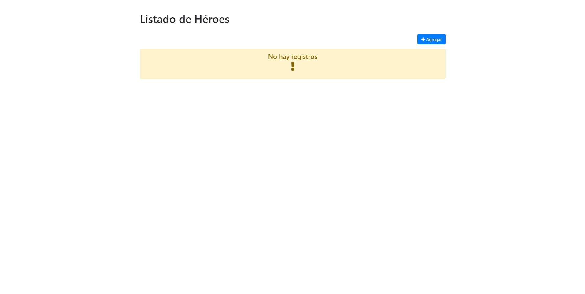
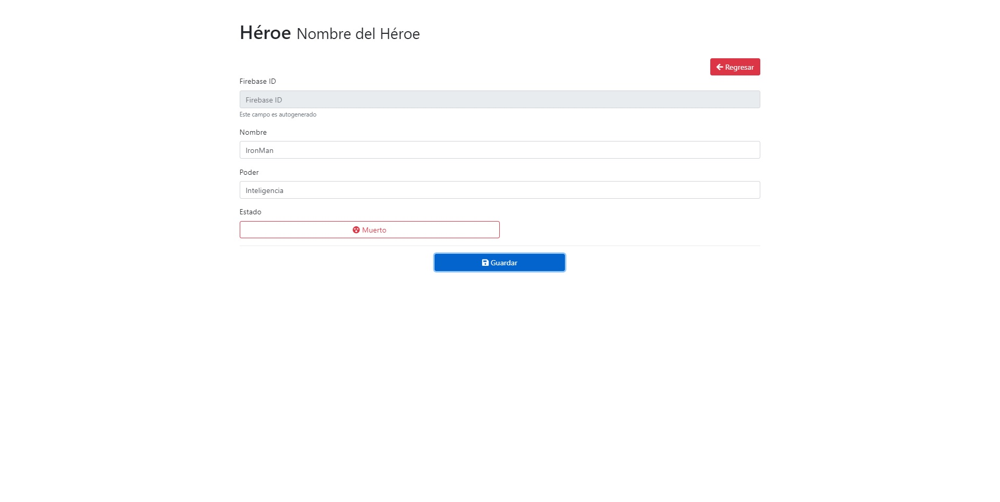
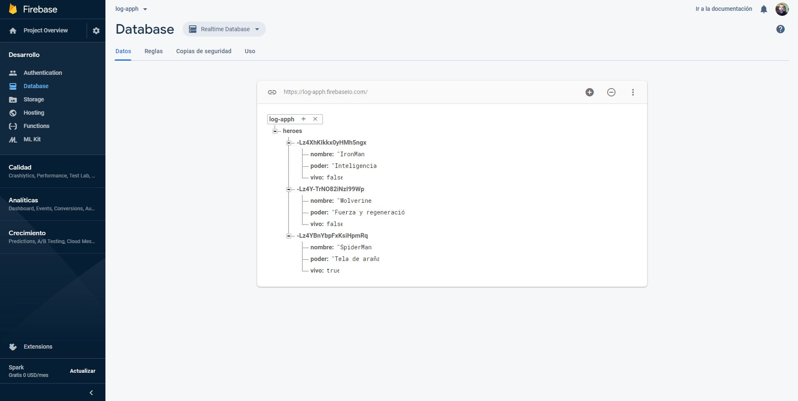

# Heroes App

Aplicación creada usando HTML5, CSS3 y JavaScript con Angular. Además de usar como base de datos a Firebase.
Es una aplicación que utiliza **ABM**(alta, baja y modificación de datos) o CRUD "Crear, Leer, Actualizar y Borrar" (del original en inglés: Create, Read, Update and Delete)

## Vistas:

### Index:

### Héroe:

### Index con datos
Listado de los heroes con ABM.

### Base de datos

## Uso:

Despues de descargar el repositorio, a traves de la linea de comando ejecutar el siguiente script:

**npm install**

y luego:

**ng serve** 

o

**ng serve -o**
